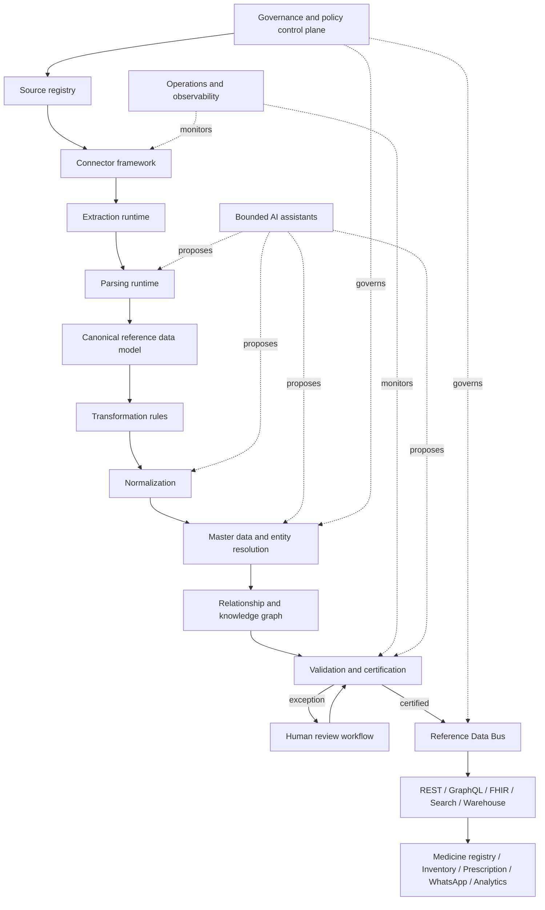

# MedLink Enterprise Reference Data Platform (MERDP) Constitution

## Document control

| Field | Value |
| --- | --- |
| Status | Architecture-frozen implementation authority |
| Scope | Enterprise healthcare reference and master data management |
| Applies to | Imports, catalog administration, medicine search, clinical knowledge, inventory, prescriptions, APIs, analytics, and AI runtimes |
| Architecture style | Metadata-driven MDM platform with event-based publication |
| Primary store | PostgreSQL/Supabase, extended by fit-for-purpose search and graph projections |
| Runtime | TypeScript services and workers in the MedLink monorepo |
| Supersedes | Standalone ETL, CRDM, transformation-runtime, and reference-intelligence designs |

## 1. Purpose

This constitution defines MERDP: one implementable system for acquiring, governing,
reconciling, certifying, and publishing MedLink reference data. ETL is a
capability of the platform; it is not the platform boundary. The platform owns
the lifecycle from source registration through certified golden records and
consumer-safe publication.

MERDP's mission is to build a governed, versioned, auditable, AI-assisted master
reference data platform that ingests healthcare reference datasets from
multiple authorities, transforms them into canonical enterprise entities,
continuously certifies their quality, and publishes trusted reference services
to every MedLink application and agent.

The implementation objective is an enterprise source of truth for medicines,
ingredients, generics, manufacturers, applicants, classifications, dosage
forms, routes, units, regulatory registrations, pharmacy identities, diseases,
diagnoses, clinical relationships, reference inventory identities, and their
provenance. MERDP owns reference identity and meaning; it does not absorb
transactional ownership. For example, it may master a pharmacy and packaged
product identity while the Inventory Engine remains authoritative for a
pharmacy's live on-hand and reserved quantities.

This document is normative. The words MUST, MUST NOT, SHOULD, SHOULD NOT, and
MAY have their RFC 2119 meanings.

The architecture is frozen at version 1.0.0. Changes require architecture
review, an ADR, impact analysis, named approval, and a new document version.
Implementation detail belongs in the MERDP Level 2 companion contracts linked
from `docs/merdp/README.md`.

## 2. Relationship to existing MedLink authority

This constitution extends, and does not weaken:

1. `IMPLEMENTATION.md` for engineering execution.
2. `docs/ENTERPRISE_RUNTIME_CONTRACT.md` for identity, tenancy, audit,
   telemetry, reliability, and certification.
3. `MedLink-AGENTS.md` for the rule that AI recommends and humans make clinical
   decisions.
4. Existing medicine-domain models and migrations.
5. Existing RLS, transactional outbox, immutable audit, and release governance.

Where an existing implementation conflicts with this target design, preserve
production compatibility, record the conflict in an ADR, and migrate through a
versioned compatibility path. Never silently reinterpret existing data.

## 3. Non-negotiable invariants

1. A source record is immutable after ingestion. Corrections create a new
   version.
2. Raw, parsed, normalized, mastered, and published data are distinct states.
3. Every derived field retains field-level provenance.
4. No source authority is inferred from ingestion order.
5. A golden record is the result of explicit survivorship rules, not a blind
   overwrite.
6. Matching suggestions never merge entities without an auditable policy or
   authorized human decision.
7. Clinical assertions require source, version, effective date, and
   certification state.
8. Uncertified or quarantined records MUST NOT enter clinical production views.
9. Reference data is global only when policy declares it global. Tenant-owned
   extensions remain isolated by RLS.
10. AI agents MUST NOT write directly to master or published stores.
11. Every accepted mutation uses an authorized application use case, atomic
    transaction, outbox event, audit record, and runtime context.
12. Downstream consumers read published contracts or subscribe to the Reference
    Data Bus; they do not read staging tables.
13. Reprocessing is deterministic for the same input, configuration, and code
    versions.
14. Deletion and retention follow approved policy and legal hold; pipeline
    convenience never determines retention.
15. Failed certification is a safe stop, not a warning that can be ignored.

## 4. Target architecture



The control plane contains policies, schemas, mappings, thresholds, ownership,
and approvals. The data plane executes versioned jobs. A policy change is a
governed deployment with impact analysis, not an ad hoc database edit.

## 5. Lifecycle and state machines

### 5.1 Dataset release lifecycle

```text
discovered -> registered -> acquired -> verified -> extracted -> parsed
-> transformed -> normalized -> matched -> mastered -> validated
-> awaiting_review -> certified -> published -> superseded
```

Terminal exceptional states are `rejected`, `quarantined`, and `revoked`.
Transitions MUST be append-only events with actor, reason, timestamps,
configuration versions, counts, and evidence references.

### 5.2 Entity certification lifecycle

```text
candidate -> validated -> review_required -> approved -> certified
certified -> superseded | revoked
```

Published projections include only `certified` entities unless a contract
explicitly exposes preview data to authorized stewards.

### 5.3 Match lifecycle

```text
proposed -> automatically_accepted | review_required
review_required -> accepted | rejected | deferred
accepted -> merged
merged -> unmerged
```

Unmerge MUST be supported using retained source assertions and merge history.

## 6. Canonical identifiers and time

- Internal identifiers MUST be immutable UUIDs and MUST NOT encode business
  meaning.
- Business keys are versioned and scoped by issuing authority.
- Crosswalks map source identifiers to canonical identifiers with validity
  periods.
- Records use `valid_from`/`valid_to` for business time and
  `recorded_at`/`superseded_at` for system time.
- All timestamps are UTC; source timezone and original text are preserved when
  relevant.
- Canonical IDs survive name changes, source changes, and golden-record
  recomputation.

## 7. Canonical Reference Data Model

### 7.1 Core entities

| Entity | Canonical purpose | Illustrative business key |
| --- | --- | --- |
| `substance` | Active or inactive chemical/biological ingredient | authority + substance code |
| `generic_product` | Ingredient combination, strength, form, and route | normalized clinical signature |
| `medicinal_product` | Marketed brand product | regulator + registration number |
| `packaged_product` | Pack presentation and pack identifiers | product + pack signature |
| `organization` | Manufacturer, applicant, regulator, distributor | authority identifier or mastered identity |
| `regulatory_authorization` | Registration, status, dates, jurisdiction | regulator + authorization number |
| `classification` | ATC and other controlled taxonomies | system + version + code |
| `dosage_form` | Controlled pharmaceutical form | code system + code |
| `administration_route` | Controlled route vocabulary | code system + code |
| `unit` | UCUM-aligned unit | system + code |
| `clinical_assertion` | Interaction, contraindication, equivalence, education | assertion type + subject + object + source version |
| `pharmacy_reference` | Mastered pharmacy identity, licensing, and location reference | authority + license/registration number |
| `disease_concept` | Canonical disease or condition terminology concept | terminology system + version + code |
| `diagnosis_concept` | Diagnosis/billing concept and mappings | code system + version + code |
| `inventory_item_reference` | Stable product/pack identity used by inventory systems | organization namespace + item business key |
| `source_assertion` | Immutable claim from one source record | source record + field/path |

### 7.2 Product composition

A product MUST support one or more ingredients. Each ingredient carries:

- substance ID;
- role: active, inactive, adjuvant, or unknown;
- numerator value and unit;
- denominator value and unit when concentration-based;
- basis-of-strength substance when supplied;
- source expression and parsing confidence.

Do not compress multi-ingredient products into a single free-text generic name.
Free text may remain as a display field, but normalized composition is the
matching authority.

### 7.3 Organization roles

Organizations are mastered independently of their roles. A product relationship
assigns `manufacturer`, `applicant`, `authorization_holder`, `importer`, or
`distributor`, with jurisdiction and validity dates. Similar names do not imply
the same legal entity.

### 7.4 Provenance model

Every canonical attribute MUST be explainable through:

```text
canonical entity
  -> golden attribute decision
  -> candidate source assertion(s)
  -> parsed record
  -> raw artifact and checksum
  -> source release and registry entry
```

The provenance record includes rule ID/version, reviewer when applicable,
confidence, transformation lineage, and timestamps.

### 7.5 Compatibility with current catalog

Existing `generics`, `medicines`, `active_ingredients`,
`medicine_ingredients`, and `therapeutic_classes` remain supported during
migration. Introduce canonical entities additively, build crosswalks, backfill
from existing rows, compare projections, then switch readers. The existing
`medicines.generic_name` field remains a display/compatibility value and MUST
NOT be treated as a complete clinical composition.

## 8. Engine specifications

### Engine 01 — Enterprise Governance Framework

**Mission.** Make ownership, policy, security, vocabulary, change, and evidence
enforceable.

**Required capabilities**

- data-domain ownership and named steward assignments;
- policy and schema registry with semantic versioning;
- naming, identifier, retention, classification, and access standards;
- source-authority matrix by entity and attribute;
- segregation of duties for rule authoring, approval, certification, and
  publication;
- immutable decision, policy-change, access, and certification audit;
- tenant/global scope declarations and RLS verification;
- data contracts, compatibility policy, deprecation windows, and ADR linkage.

**Minimum tables**

`data_domains`, `data_stewards`, `governance_policies`, `policy_versions`,
`controlled_vocabularies`, `vocabulary_versions`, `data_contracts`,
`contract_versions`, `governance_decisions`, `retention_schedules`.

**Acceptance gates**

- no production source without owner, steward, legal basis, and refresh policy;
- no rule version may certify its own output without authorized approval;
- all privileged actions prove tenant scope and least privilege;
- retention schedules cover raw artifacts, intermediate data, evidence, and
  published history.

### Engine 02 — Canonical Enterprise Data Model

**Mission.** Define the enterprise semantic contract described in Section 7
across medicine, organization, pharmacy, disease, diagnosis, terminology,
clinical knowledge, and reference inventory identity domains.

Schema changes MUST be additive by default, generated into TypeScript contracts,
validated at boundaries, mapped to FHIR terminology/resources where applicable,
and accompanied by migration, rollback, data-quality, and compatibility plans.
Canonical tables are not generic key/value bags. Extensions use governed typed
namespaces and JSON only where the shape is genuinely source-specific.

### Engine 03 — Reference Data Source Registry

**Mission.** Maintain the authoritative inventory and risk posture of NAFDAC,
WHO, FDA, EMA, internal, partner, and file-based sources.

Each source registration MUST specify owner, authority, jurisdiction, content
scope, access method, credentials reference, license/terms, expected format,
refresh cadence, freshness SLO, trust tier, checksum/signature behavior,
schema-drift policy, retention, and incident contact.

`source_releases` capture the source's own version, discovery time, effective
period, artifact manifest, record count when known, and acquisition outcome.
Duplicate releases are detected by stable source identity plus content hashes.

### Engine 04 — Universal Connector Framework

**Mission.** Acquire HTML, XML, JSON, CSV, Excel, PDF, API, SFTP, and FHIR data
through reusable adapters.

Connectors MUST implement a typed contract:

```ts
interface ReferenceConnector {
  discover(context: ConnectorContext): Promise<readonly SourceCandidate[]>;
  acquire(candidate: SourceCandidate, context: ConnectorContext): Promise<ArtifactManifest>;
  checkpoint(): Promise<ConnectorCheckpoint>;
  health(): Promise<DependencyHealth>;
}
```

Connectors own transport behavior only. They MUST NOT contain product mappings,
clinical rules, matching logic, or direct writes to canonical tables. They use
workload identity, managed secrets, bounded retries, rate limits, conditional
requests, resumable checkpoints, and source-respectful scheduling.

### Engine 05 — Enterprise Extraction Runtime

**Mission.** Turn acquired artifacts into verifiable document units without
discarding evidence.

The engine performs media detection, malware scanning, decompression limits,
page and sheet discovery, OCR when required, encoding detection, metadata
capture, checksums, and artifact lineage. OCR output retains page coordinates,
engine/version, language, confidence, and links to the original bytes.

Extraction is deterministic where possible. Unsafe archives, corrupt files,
checksum failures, password-protected documents without approved credentials,
and unsupported media enter quarantine.

### Engine 06 — Parsing Runtime

**Mission.** Convert document units into structured source records using
versioned parsers.

Provide grammar, table, HTML, delimited-text, spreadsheet, JSON, XML, and FHIR
parsers. A parser returns records plus warnings, field spans, confidence,
unconsumed content, and parser version. It MUST never silently drop malformed
rows or unknown columns.

Parser fixtures include representative, boundary, malformed, drifted, and
adversarial artifacts. Schema drift produces a measured compatibility report
and blocks publication when required fields or meanings change.

### Engine 07 — Transformation Engine

**Mission.** Execute declarative, reviewable, testable mappings from parsed
source records to canonical candidates.

Every transformation rule has stable ID, semantic version, inputs, outputs,
precedence, effective dates, owner, reviewer, test fixtures, reason, and status.
Rules are stored as safe declarative expressions or compiled packages; arbitrary
database code from an administrative UI is forbidden.

The engine records field-level lineage and a reproducibility manifest containing
artifact hashes, parser version, rule bundle, vocabulary versions, runtime
version, and configuration hash.

### Engine 08 — Normalization Engine

**Mission.** Normalize names, strengths, units, dosage forms, routes,
organizations, applicants, and classifications without destroying source text.

Normalization MUST be locale-aware, Unicode-aware, deterministic, and domain
specific. It MUST distinguish display normalization from matching normalization.
UCUM-aligned unit conversion uses dimensional checks; invalid or ambiguous
conversions are rejected. Strength normalization supports ratios,
concentrations, percentages, multiple ingredients, and basis-of-strength.

Synonyms, abbreviations, transliterations, and stop words live in versioned
vocabularies. A normalized value always retains its original expression.

### Engine 09 — Entity Resolution Engine

**Mission.** Generate explainable identity candidates through governed matching
without conflating candidate generation with golden-record stewardship.

Candidate generation uses safe blocking keys. Matching combines exact business
keys, normalized product signatures, identifiers, names, organization context,
jurisdiction, and temporal validity. Each feature and weight is versioned and
explainable.

Outcomes use configurable thresholds:

- high confidence plus policy eligibility: automatic acceptance;
- intermediate confidence or conflict: human review;
- low confidence: retain separate entities;
- prohibited ambiguity: quarantine.

### Engine 10 — Master Data Management Engine

**Mission.** Create durable canonical IDs and golden records through approved
merge, crosswalk, versioning, and survivorship decisions.

Survivorship is field-level. A typical precedence is regulator-of-record,
recognized international authority, licensed internal stewardship, then other
sources, modified by freshness, jurisdiction, completeness, and certification.
No universal precedence list applies to every attribute.

Required structures include `master_entities`, `entity_versions`,
`source_crosswalks`, `match_candidates`, `match_features`, `match_decisions`,
`merge_history`, `survivorship_rules`, and `golden_attribute_decisions`.

### Engine 11 — Relationship Engine

**Mission.** Govern typed links among canonical entities independently of any
particular graph technology.

Relationships have stable IDs, subject and object versions, direction,
cardinality, validity periods, provenance, confidence, certification, and
governance ownership. Relationship rules enforce domain constraints such as
product composition, regulatory authorization, organization roles, pharmacy
affiliation, diagnosis terminology, and packaged-product identity.

### Engine 12 — Knowledge Graph Engine

**Mission.** Build governed relationships without making the graph the system
of record.

Canonical relational data remains authoritative. Graph nodes and edges are
versioned projections. Edge types include contains-ingredient, manufactured-by,
authorized-by, classified-as, equivalent-to, interacts-with, contraindicated-
for, replaces, and sourced-from.

Every edge declares direction, validity, provenance, confidence, certification,
and assertion type. Clinical relationships cannot be inferred into published
facts unless a policy explicitly permits the inference and validation certifies
it. Graph rebuilds are repeatable from canonical state and events.

### Engine 13 — Clinical Enrichment Engine

**Mission.** Add governed clinical knowledge such as pregnancy and lactation
considerations, contraindications, interactions, monitoring requirements,
therapeutic alternatives, disease mappings, and guideline associations.

Enrichment is assertion-based, not destructive augmentation of product rows.
Every assertion names its subjects, predicate, evidence, jurisdiction,
population, severity or strength, effective period, source version, and
certification. Conflicting sources coexist until an explicit clinical policy
resolves what a consumer view may present. Alice may propose enrichment, but a
qualified human and deterministic validation controls certify it.

### Engine 14 — Search Intelligence Engine

**Mission.** Publish fast, explainable discovery across certified enterprise
reference entities.

Search supports exact identifiers, autocomplete, synonyms, spelling tolerance,
phonetic candidates where appropriate, transliteration, clinical composition,
classification, and relationship-aware queries. Ranking features and versions
are measurable. Tenant authorization and certification filters apply before
results are returned. Search never becomes a separate master store; its index
is a rebuildable projection with freshness and completeness reconciliation.

### Engine 15 — Validation Engine

**Mission.** Measure fitness, detect exceptions, and issue certification
decisions.

Validation layers are syntactic, semantic, referential, temporal, clinical,
cross-source, and distributional. Quality dimensions include completeness,
validity, uniqueness, consistency, accuracy proxy, timeliness, provenance
coverage, and reconciliation.

Quality scores never hide critical failures. A release with a high aggregate
score still fails if a hard safety rule fails. Each rule has severity,
applicability, owner, remediation, threshold, and evidence query.

### Engine 16 — Certification Engine

**Mission.** Convert validation results and authorized approvals into immutable,
revocable release decisions.

Certification produces a signed evidence manifest containing input/output
hashes, rule versions, counts, exceptions, approvals, test results, and runtime
identity. Revocation is supported when a defect is discovered after publication.

### Engine 17 — Exception Workflow Engine

**Mission.** Route ambiguity and conflicts to qualified people with complete
evidence.

Queues are role-, domain-, jurisdiction-, risk-, and SLA-aware. Reviewers see
side-by-side sources, provenance, normalized values, matching rationale,
conflicts, prior decisions, and downstream impact. They may accept, reject,
edit through an authorized correction flow, defer, request evidence, or
escalate.

Clinical assertions and clinically meaningful equivalence require pharmacist or
other appropriately licensed approval. Administrative stewards cannot approve
clinical truth merely because they can edit catalog data. All overrides require
reason codes and are reusable as evaluated examples, never automatic training
labels.

### Engine 18 — Publishing Platform and Reference Data Bus

**Mission.** Decouple mastered data from consumer-specific contracts.

Certification writes an immutable publication manifest and transactionally
records outbox events. The Reference Data Bus publishes versioned envelopes:

```ts
interface ReferenceDataEvent<T> {
  eventId: string;
  eventType: string;
  schemaVersion: string;
  entityType: string;
  entityId: string;
  entityVersion: number;
  certificationId: string;
  occurredAt: string;
  correlationId: string;
  operation: "upsert" | "supersede" | "revoke";
  data: T;
}
```

Consumers are idempotent, checkpointed, replayable, and contract tested. REST,
GraphQL, FHIR, search, graph, warehouse, and bulk-export projections expose
consumer-appropriate shapes while retaining canonical identifiers, versions,
provenance summaries, and certification status.

FHIR mappings SHOULD use R4/R5 resources and terminology artifacts appropriate
to the selected interoperability target; the precise version is a governed
contract choice, not assumed by an importer.

### Engine 19 — Runtime Operations

**Mission.** Operate the platform as a recoverable production service.

Orchestration uses durable jobs, leases, idempotency keys, bounded retries,
timeouts, circuit breakers, dead-letter queues, checkpoints, cancellation, and
replay. Each stage emits redacted structured logs, metrics, and traces using the
enterprise runtime context.

Required metrics include source freshness, acquisition duration, bytes and rows,
parse success, drift rate, normalization exceptions, match distribution,
auto-merge rate, review backlog/age, quality failure rate, certification lead
time, publication lag, consumer lag, replay rate, and revocations.

Each failure class has a runbook. Operators can pause one source, rule bundle,
release, projection, or consumer without stopping unrelated flows. Recovery
never skips validation or audit.

### Engine 20 — Enterprise AI Layer

**Mission.** Assist bounded stages while preserving deterministic controls and
human authority.

| Agent | Responsibility | May propose | MUST NOT |
| --- | --- | --- | --- |
| Piper | Connector and extraction assistance | layouts, field regions, drift classification | fetch with unapproved credentials or certify extraction |
| Nova | Normalization assistance | synonyms, canonical candidates, parsing suggestions | overwrite controlled vocabularies |
| Orion | Entity resolution | match candidates and explanations | merge canonical entities |
| Alice | Clinical knowledge validation | conflicts, missing evidence, risk flags | approve clinical assertions |
| Atlas | Knowledge graph construction | candidate edges and ontology mappings | publish inferred clinical facts |
| Quinn | Workflow orchestration | routing, priority, remediation suggestions | bypass queues or approvals |
| Sentinel | Governance, compliance, security | policy violations and control evidence | grant itself access or approve exceptions |

Every AI result has typed output, model/provider/version, prompt/template
version, confidence, evidence references, policy flags, latency, and escalation
state. Inputs are minimized and redacted. AI is not used when a deterministic
rule is adequate. Model upgrades require offline evaluation, safety review,
versioned rollout, monitoring, and rollback.

## 9. Physical data architecture

Use separate logical schemas or equally strong access boundaries:

| Zone | Purpose | Consumer access |
| --- | --- | --- |
| `rdb_control` | sources, schemas, rules, policies, jobs | control-plane services only |
| `rdb_raw` | artifact metadata and immutable source records | pipeline workloads and auditors |
| `rdb_stage` | parsed and transformed candidates | pipeline and reviewers |
| `rdb_master` | canonical entities, crosswalks, lineage, decisions | MDM services |
| `rdb_publish` | certified projections and manifests | application readers |
| `rdb_audit` | immutable decisions and evidence | auditors and certification |

Raw artifact bytes belong in protected object storage; PostgreSQL stores hashes,
manifests, lineage, and access references. Large blobs MUST NOT be embedded in
events or ordinary audit rows.

Every tenant-owned row carries `organization_id` and enforced RLS. Global
reference rows carry an explicit scope and cannot be shadowed by tenant data
without a governed overlay model. Service-role access is isolated to named
workers and never exposed to user-facing routes.

## 10. API and service boundaries

Implement ports around these capabilities:

- `SourceRegistryService`
- `ConnectorExecutionService`
- `ArtifactExtractionService`
- `ParsingService`
- `TransformationService`
- `NormalizationService`
- `EntityResolutionService`
- `MasteringService`
- `GraphProjectionService`
- `QualityEvaluationService`
- `ReviewWorkflowService`
- `CertificationService`
- `PublicationService`
- `ReferenceEventConsumer`

Routes and workers validate contracts and invoke one application use case. They
do not query tables directly or embed business rules. Repositories are domain
ports; Supabase/PostgreSQL implementations remain infrastructure adapters.

Administrative APIs provide dry-run, impact preview, pagination, idempotency,
optimistic concurrency, reason codes, and correlation IDs. Bulk operations are
asynchronous, resumable, and blast-radius limited.

## 11. Reference Data Bus contract

The bus is a logical product contract implemented initially by the existing
transactional outbox and workers. It does not require adopting new broker
infrastructure before load or reliability evidence justifies it.

Topic families:

- `reference.source-release.*`
- `reference.entity.*`
- `reference.relationship.*`
- `reference.certification.*`
- `reference.vocabulary.*`
- `reference.publication.*`

Ordering is guaranteed per entity or aggregate key, not globally. Delivery is
at least once; consumers deduplicate by `eventId` and reject unsupported schema
versions. Retention supports full projection rebuild for the approved recovery
window. Sensitive source payloads are referenced, not copied into general
events.

## 12. Security, privacy, and compliance

- Classify every source field before production ingestion.
- Minimize patient data: this platform primarily handles reference data and
  MUST NOT become an accidental patient-data lake.
- Verify source authenticity where signatures or official checksums exist.
- Scan files before parsing and enforce archive, row, cell, formula, entity,
  recursion, and decompression limits.
- Prevent spreadsheet formula execution and XML external-entity expansion.
- Treat source text and documents as untrusted content, including prompt
  injection risks for AI-assisted parsing.
- Encrypt data in transit and at rest; use managed secret references.
- Log access to protected artifacts and privileged mastering operations.
- Apply approved retention, deletion, legal hold, residency, and licensing
  policy to raw and derived data.
- Perform threat modeling for each connector class and each new publication
  surface.

## 13. Quality and certification gates

A source release cannot publish until all applicable gates pass:

1. Artifact integrity and source identity verified.
2. Malware and resource-exhaustion controls passed.
3. Parser coverage and unconsumed-content thresholds passed.
4. Required fields and vocabulary mappings passed.
5. Referential and temporal consistency passed.
6. Duplicate, match, merge, and conflict thresholds passed.
7. Clinical hard-stop rules passed.
8. Reconciliation to source totals completed or explained.
9. Regression and distribution-change analysis approved.
10. Review queues contain no publication-blocking cases.
11. Data contract compatibility passed.
12. Evidence manifest signed by authorized certifier.

Emergency publication requires a pre-approved policy, named authority, limited
scope, expiry, compensating controls, consumer notification, and retrospective
review. It never permits a known clinical-safety violation.

## 14. Testing strategy

Every engine provides:

- unit tests for pure rules and state transitions;
- golden-file tests for parsers and mappings;
- property tests for normalization and unit conversion;
- contract tests for connectors, events, APIs, and projections;
- migration tests against empty and representative databases;
- RLS and privilege tests;
- idempotency, concurrency, retry, replay, and unmerge tests;
- provenance completeness tests;
- quality-rule mutation tests;
- load tests at expected and stress volumes;
- chaos tests for source, storage, database, queue, and model outages;
- clinical safety review for applicable transformations and assertions;
- deterministic rebuild comparison by manifest and projection hashes.

Production certification retains machine-readable evidence. A Markdown claim is
not execution evidence.

## 15. Operational objectives

Initial SLOs are proposed values and require approval after baseline testing:

| Objective | Proposed target |
| --- | --- |
| Certified-source freshness | 99% within each source's registered freshness window |
| Publication availability | 99.9% monthly for certified read APIs |
| Event publication lag | p95 under 60 seconds after certification |
| Critical-source ingestion recovery | RTO under 4 hours |
| Certified master data loss | RPO 0 for committed canonical decisions |
| Provenance coverage | 100% of published canonical attributes |
| Critical quality escapes | 0 known unresolved safety-critical defects |

Alerting uses burn rates and consumer impact, not raw error counts alone.

## 16. Delivery roadmap

### Prerequisite — Decisions and baseline

- appoint domain owner, lead data steward, clinical certifier, security owner,
  and platform owner;
- approve source licensing, retention, residency, and deletion policies;
- profile the existing catalog and record baseline quality;
- approve this constitution and create ADRs for material deviations;
- define pilot sources and measurable success criteria.

### Wave 1 — Core Reference Platform (MVP)

- implement governance, canonical model foundations, source registry, release
  manifests, raw artifact storage, checksums, job state, and immutable lineage;
- ship one NAFDAC/Greenbook connector through extraction and parsing;
- add transformation, validation, certification, versioning, parser fixtures,
  quarantine, drift detection, metrics, and runbooks;
- prove deterministic replay without altering current production readers.

### Wave 2 — Master Data Platform

- complete substance, organization, authorization, product, pack, pharmacy,
  inventory-item-reference, and vocabulary schemas;
- implement declarative mappings, normalization, entity resolution, golden
  records, crosswalks, version history, and merge/unmerge;
- backfill crosswalk candidates from current catalog;
- ship the certified canonical registry and search projection;
- run shadow comparisons against existing medicine search and equivalency and
  migrate readers behind compatibility flags.

### Wave 3 — Knowledge Platform

- implement governed relationships and rebuildable knowledge-graph projections;
- introduce disease and diagnosis mappings, clinical enrichment, interactions,
  alternatives, and guideline associations;
- require qualified approval for clinical assertions and establish clinical
  quality dashboards and certification evidence;
- publish certified events and migrate knowledge consumers incrementally.

### Wave 4 — Intelligent Reference Services

- introduce bounded Piper, Nova, and Orion assistance with offline evaluations,
  predictive quality assistance, and continuous synchronization;
- add Atlas, Alice, Quinn, and Sentinel only after their deterministic controls
  and human review paths exist;
- publish approved FHIR services, analytics, and event-driven consumer contracts;
- test production-scale datasets and revise SLOs from measured evidence;
- certify disaster recovery and operational readiness.

## 17. Definition of done for each vertical slice

A slice is done only when it includes:

1. approved contract and ownership;
2. schema and safe migration;
3. typed domain and application interfaces;
4. least-privilege infrastructure adapter;
5. runtime-context propagation;
6. idempotent transaction and outbox behavior;
7. immutable audit and complete lineage;
8. metrics, logs, traces, health, and alerts;
9. error catalog, retries, DLQ, replay, and runbook;
10. unit, integration, contract, security, and recovery tests;
11. retained machine-readable certification evidence;
12. documentation and rollback plan;
13. no unresolved critical or high clinical-safety findings.

## 18. Implementation-agent superprompt

The following instructions govern any coding agent implementing this platform.

### Role

You are an enterprise healthcare data-platform engineer working inside the
MedLink monorepo. Implement MERDP incrementally.
Treat this constitution and the existing enterprise runtime contract as binding.
Your objective is working, tested, reviewable software—not speculative
architecture or certification claims without evidence.

### Required working method

1. Read repository instructions, current migrations, medicine-domain contracts,
   runtime authority, release scope, and relevant audit gaps before editing.
2. Inspect the actual code and database. Do not assume a capability exists
   because a document names it.
3. State the selected vertical slice, dependencies, compatibility impact,
   risks, and acceptance evidence.
4. Prefer the smallest end-to-end slice that creates a usable governed
   capability.
5. Extend existing TypeScript, Supabase, outbox, audit, and certification
   patterns. Do not create a second platform framework.
6. Make schema changes additive unless an approved migration plan proves a
   breaking change is safe.
7. Keep transport, parsing, transformation, normalization, mastering,
   certification, and publication boundaries distinct.
8. Encode business rules in versioned governed modules or declarative rule
   bundles, not route handlers, UI components, or connector code.
9. Preserve raw evidence and field-level lineage.
10. Never auto-merge or publish outside the approved policy thresholds.
11. Never let AI write master data, certify clinical assertions, or bypass a
    pharmacist.
12. Update tests and documentation in the same change.
13. Run the narrowest relevant checks first, then broader repository checks.
14. Report exact commands, results, remaining gaps, and any evidence that could
    not be produced locally.

### Mandatory design questions before implementation

- What entity or release state changes?
- Who owns and who may approve that transition?
- What is the idempotency key?
- What is atomic with the transition?
- Which outbox event is recorded?
- How is the action audited?
- How is every output field traced to source evidence?
- What fails closed?
- What is retried, replayed, quarantined, or sent to a DLQ?
- How is an incorrect merge undone?
- How are existing readers kept compatible?
- What machine-readable evidence proves the acceptance criteria?

### Prohibited shortcuts

- direct staging-to-production table copies;
- last-write-wins golden records;
- free-text clinical composition as the sole canonical representation;
- source precedence encoded only in application conditionals;
- connector-specific business logic;
- destructive migration without rollback and reconciliation;
- unversioned parsers, rules, vocabularies, prompts, or events;
- downstream reads from raw or staging zones;
- undocumented service-role access;
- aggregate quality scores that mask safety-critical failures;
- claiming production or clinical certification from mocked tests alone.

### Required output for each implementation cycle

Provide:

1. scope completed;
2. files changed;
3. schema and contract changes;
4. compatibility and migration behavior;
5. tests and commands run with results;
6. security, tenancy, clinical-safety, and provenance assessment;
7. operational behavior and recovery path;
8. retained evidence location;
9. open decisions and risks;
10. the next smallest safe vertical slice.

### First authorized slice

Unless repository authority selects a different slice, begin with a pilot source
registry and immutable release/artifact manifest. Do not begin with AI, graph
infrastructure, GraphQL, or a new event broker. The first slice must register a
source, record a discovered release, acquire one artifact, verify its hash,
retain lineage, safely retry, quarantine failure, emit metrics and audit, and
prove deterministic replay without changing current medicine-catalog readers.

## 19. Open decisions requiring human authority

The following are deliberately not invented by this document:

1. Which NAFDAC publication and access method constitute the pilot source.
2. Licensing and permitted retention/redistribution for each external source.
3. Data residency and cross-border processing requirements.
4. Retention periods and deletion authority for raw artifacts and derived data.
5. Named business owner, data steward, and clinical certifier.
6. Exact FHIR version, implementation guide, and terminology bindings.
7. Approved source-authority and survivorship matrices by attribute.
8. Auto-match thresholds and classes prohibited from automatic acceptance.
9. Broker adoption threshold beyond the existing transactional outbox.
10. Production SLO, RTO, and RPO approvals after measured baseline tests.

No implementation agent may resolve these policy decisions by assumption.

## 20. Final acceptance criteria

MERDP is enterprise-ready only when:

- the 20 engines have implemented, owned contracts rather than document-only
  labels;
- a real pilot source traverses the complete lifecycle reproducibly;
- every published attribute has verifiable provenance;
- master-data merges are explainable and reversible;
- clinical assertions have qualified approval and evidence;
- consumers use certified contracts or bus events;
- tenant isolation and privileged-workload controls are independently tested;
- freshness, quality, backlog, publication, and consumer-lag SLOs are measured;
- replay, restore, revocation, and disaster recovery are exercised;
- certification evidence is retained and independently reviewable;
- no unresolved critical security, privacy, data-integrity, or clinical-safety
  finding remains.

Until those conditions are proven, describe the platform by the capability and
environment actually evidenced. Do not call it production-certified merely
because its architecture is complete.
